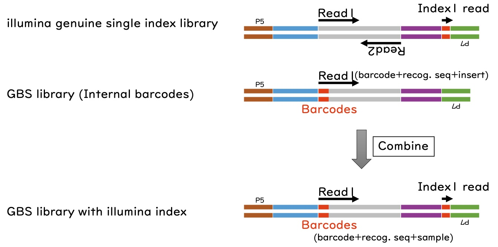

# Genoytyping by sequencing

イネの遺伝解析ではDNAの配列を「とびとびに」読むだけで十分な場合が多く、その場合は多くの個体（>2000サンプル）を一度の次世代シーケンス（NGS）解析で調べることができます。得意技として運用し、他の研究室とコラボしています。

[Ha et al. 2024](https://doi.org/10.1270/jsbbs.24036)
[Furuta et al. 2017](https://doi.org/10.1534/g3.116.038190)
ほか多数