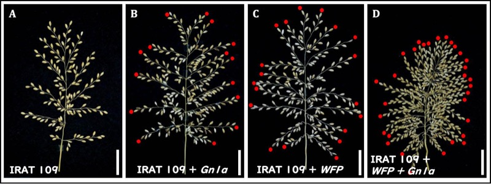

# WISHプロジェクト

名古屋大学発の「世界の稲作をよくする」WISHプロジェクトに参画しています。

[WISH site at Ashikari Lab](http://motoashikari-lab.com/intro/wish/) 
[Reyes et al. 2021](https://doi.org/10.3390/plants10050844) 
[Kurokawa et al. 2016](https://doi.org/10.1016/j.plantsci.2015.09.008) 
[ケニアでの活動（SATREPS）](https://www.jst.go.jp/global/kadai/h2406_kenya.html) 
[WISHプロジェクト(Google search)]("https://www.google.com/search?q=WISHプロジェクト 名古屋大学")